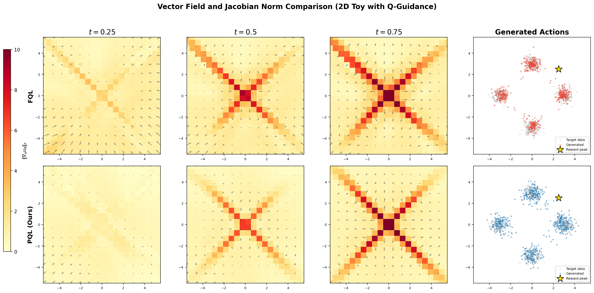
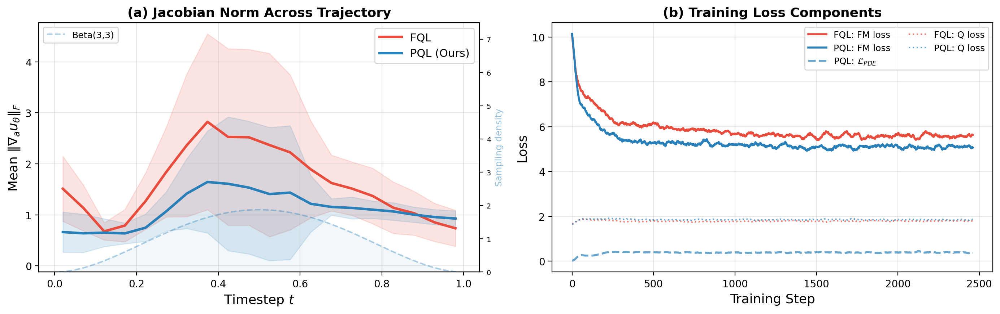
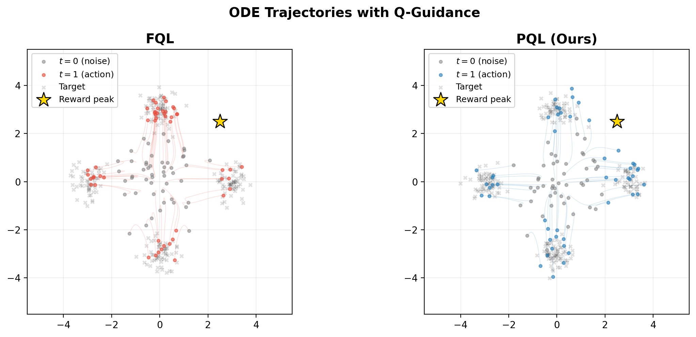
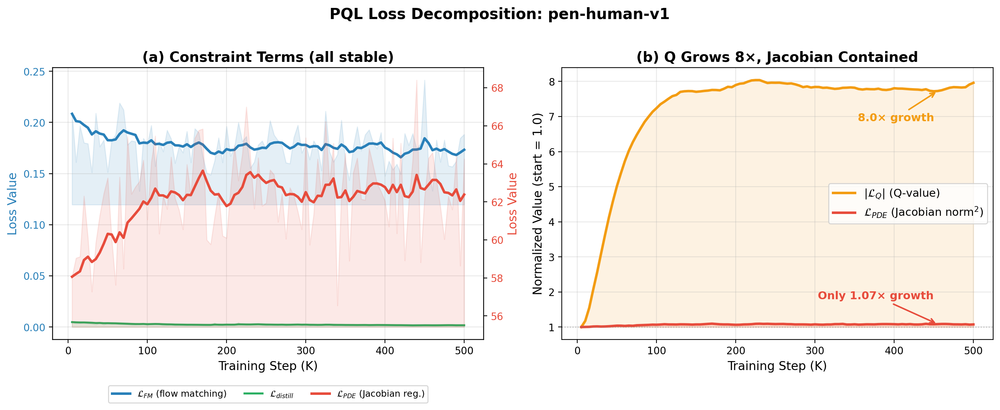

# Rebuttal Figures for Submission 8716

## Figure R1: Vector Field and Jacobian Norm Comparison (2D Toy with Q-Guidance)

## Figure R2: Jacobian Norm Across Trajectory and Training Loss Components

## Figure R3: ODE Trajectories with Q-Guidance

## Figure R4: PQL Training Loss Decomposition (pen-human-v1, 500K steps)

