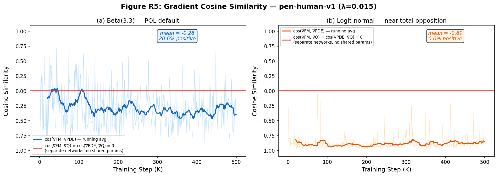
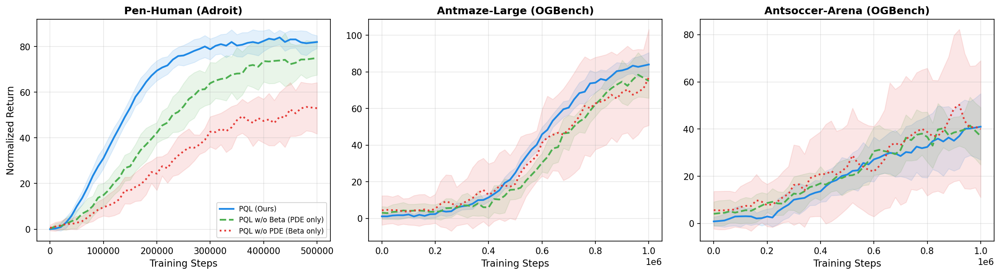

# Figure R1: Vector Field and Jacobian Norm Comparison (2D Toy with Q-Guidance)

# Figure R2: Jacobian Norm Across Trajectory and Training Loss Components

# Figure R3: ODE Trajectories with Q-Guidance

# Figure R4: PQL Training Loss Decomposition (pen-human-v1, 500K steps)

# Figure R5: Gradient Cosine Similarity Between $\nabla L_{FM}$ and $\nabla L_{PDE}$

# Figure R6: Training Curves with Ablations (mean ± std, 8 seeds) on Pen-Human, Antmaze-Large, and Antsoccer-Arena.

---

## Table R1: Aggregated Performance (Macro-Average per Suite)

| Algorithm | D4RL Gym-MuJoCo | Adroit | OGBench |
|---|:-:|:-:|:-:|
| BC | 51.9 | 36.8 | 0.6 |
| IQL | 77.1 | 53.6 | 18.3 |
| CQL | 64.0 | 40.3 | 14.1 |
| IDQL | 78.2 | 52.2 | 17.7 |
| SRPO | **86.8** | 50.7 | 12.5 |
| CAC | 81.9 | 42.9 | 20.5 |
| FQL | 33.6 | 51.6 | 38.6 |
| FAWAC | — | 48.2 | 12.1 |
| FBRAC | — | 50.0 | 27.7 |
| IFQL | — | 52.4 | 22.5 |
| Flow | 79.4 | — | — |
| CNF | 82.0 | — | — |
| **PQL (Ours)** | 85.2 | **57.9** | **42.7** |

---

## Table R2: Cross-Method Generalization — FBRAC ($\lambda=0.015$)

| Config | Pen-Human | Antmaze-Large |
|---|---|---|
| FBRAC (original) | $77\pm7$ | $70\pm20$ |
| FBRAC + PDE only | $74\pm5$ | $66\pm13$ |
| FBRAC + PDE + Beta | **$82\pm4$** | **$75\pm10$** |

---

## Table R3: Alternative Timestep Distributions (pen-human-v1, $\lambda=0.015$)

| Distribution + PDE | Pen-Human |
|---|---|
| Uniform | $75\pm8$ |
| Truncated normal | $74.3\pm5$ |
| Logit-normal | $71.2\pm4$ |
| **Beta(3,3)** | **$82\pm3$** |
